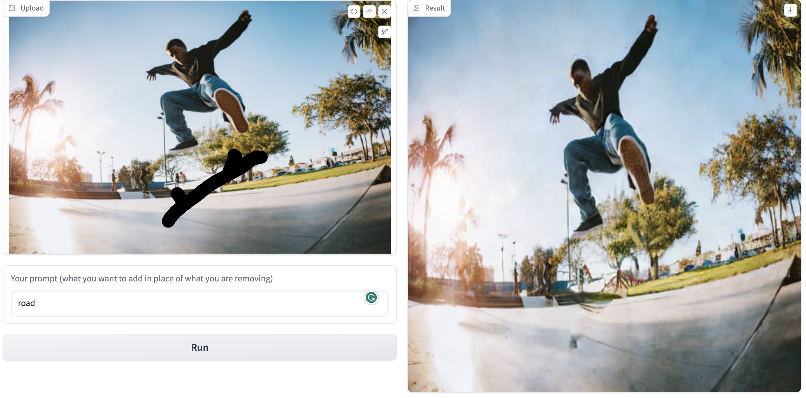
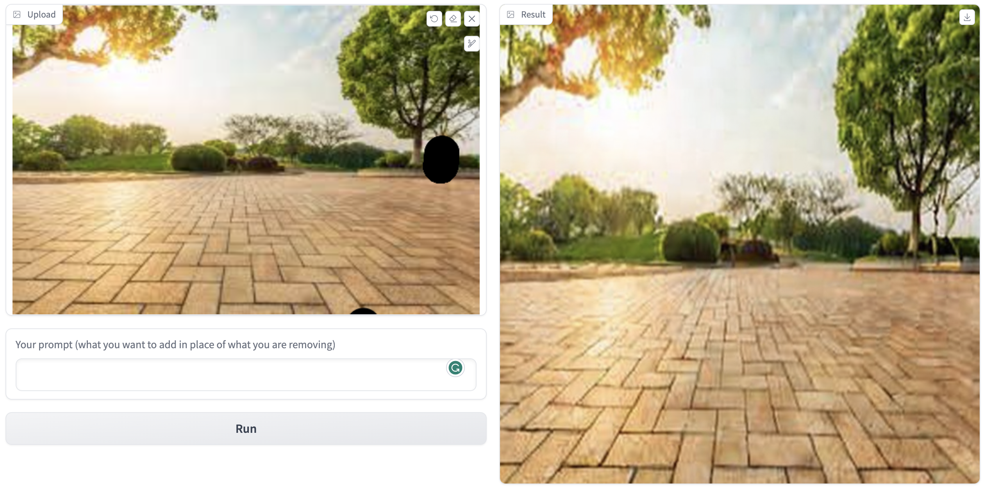
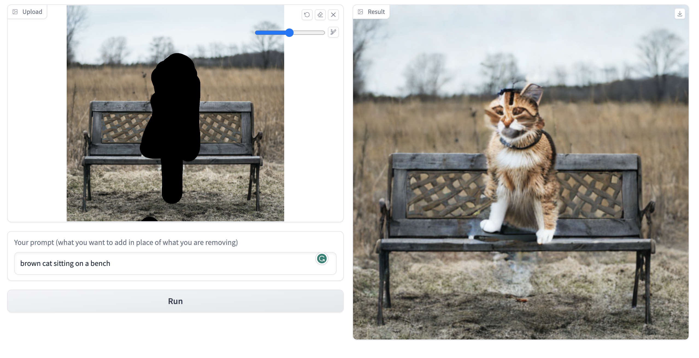
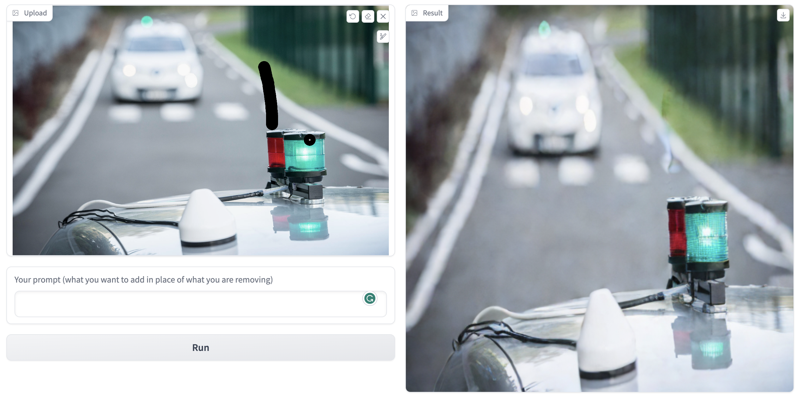
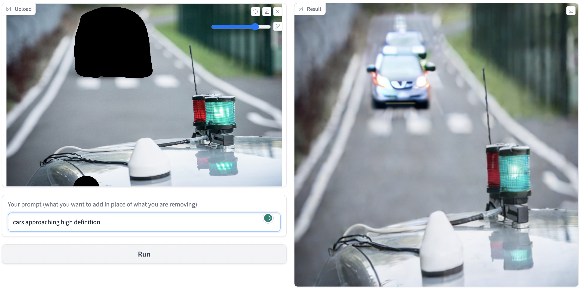
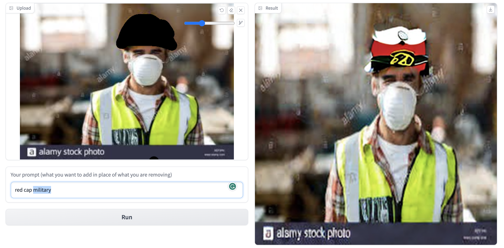

# InPainting implementation For Stable Diffusion

This repo shows an advanced imnplementation of inpainting mechanism designed using stable diffusion and related models. It requires 3 inputs: original image, mask and a promt in the result in the place of mask, similar things will be created by the guidance of the text and the original image as well.

#### imported the related models for the pipeline
The first step was to download the models which are required for the stable diffusion pipeline. For the input image, a variational auto encoder will be required to conver it to lower dimensional latents which we will be editing. Next we will be needing a unet which helps in predicting the noise in the imnage which will be useful when we are trying to remove the noise from the image. After that a scheduler will be needed to directly add a noise according to a timestep as well remove the predicted noise from the image in th esequential manner. At last a tokeniser and a text encoder will be required to convert the input prompt to a an embedding which can be used as an input to the unet for making the output similar to the prompt.

#### Front End
Used gradio to get create a front end for the application. It takes 3 inputs currently which is an original image, a mask on top of it and a prompt and inference starts when "Run" is clicked. Other things which could be added as an input can be a guidance number which how much a picture will be similar to the prompt entered and how much of it will be creative. Other can be a noise indicator which how much of the image will be creative based and how less of it will be related to the initial one.

## Inpainting Pipeline

#### Processing of input image, mask 
The original input image is converted to tensor normalised and the values are brought between 0 and 1 and expanded to create a fake batch. Its output dimensions are [1,3,512,512]. This output will then be passed through a vae to encode it in latents with dimensions [4,64,64] and then multiplied with some constants. 
Processing of mask was tricky, I had 2 ways to compress it in the latents 
1. The first one was passing it through the variational auto encoder and directly compress it. 
2. Second one was converting it to black and white format with just one channel, then resizing it to [64,64] and multiplying it with 4 as the mask should remain same for the 4 channels of the input image.
I tried both the approaches and first one wasnt giving good results, original was getting damaged quite a lot and was guided by the prompt whereas for the second case most of the prompt guided output was inside the masked area. Will later specify how i think was the error in the first approach.  

#### Processing of the prompt
Passed the prompt through a tokenizer and then through a text encoder to convert it to the desired embedding dimensions. Then an emtpy string is taken as a prompt and is passed through the same steps. This type of embedding is required to promote creativity in the image. The below pipeline will be run 2 times simulatenously and 2 noise will be predicted, one for conditioned promt and one for unconditioned promt. The weightage or ratio of these noise in the final noise will dictate how much creativity or promt guided a image will be.

#### How is impainting implemented
Firstly the number of inference steps are selected which is based on the noise inserted in the image initially. Then instead of running the scheduler for the full loop, we run it for a less time as the image is not full noisy and it has some of the initial data. This noisy image is then passed to a loop where noise in the image will be predicted by the unet and then removed by the scheduler. The noise image is divided in 2 parts - unconditioned and conditioned which are then summed according to the guidance provided. The major step which diffrentiates it from the normal stable diffusion pipeline is give below:
> init_latents_initialWithNoise = scheduler.add_noise(init_latents_orig, noise, t)  
> latents = (init_latents_initialWithNoise * mask) + (latents * (1- mask))  

The above lines makes sure that the masked part whick has 0 in the areas masked is multiplied by the original latents with noise and not the ones where noise is predicted after getting from unet. This is because we dont want our prompt to intefare with our non masked part of the image. The (1 - mask) part ensures that where there is 1(in the painted part), that part is multiplied with latents received from the unet which itself is derived using the prompt. So using this only the masked part of image is getting influenced with a prompt which was the task of this project.     

The final latents received from the pipeline are then passed through a vae decoder which then returnsthe tensor of initial dimensions and final moditified image is retrieved.

### Some results

</img>
</img>
</img>
</img>
</img>
</img>

