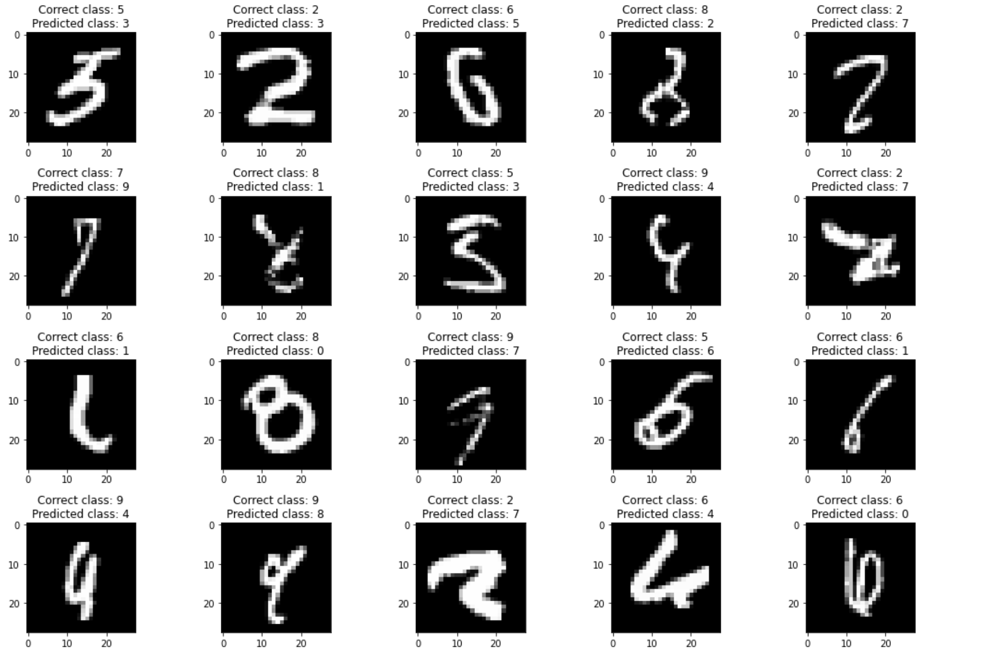
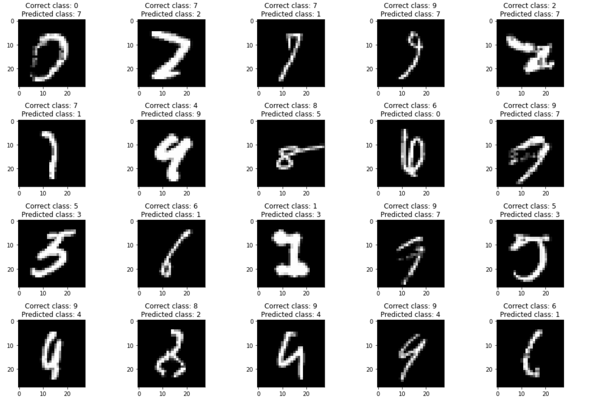
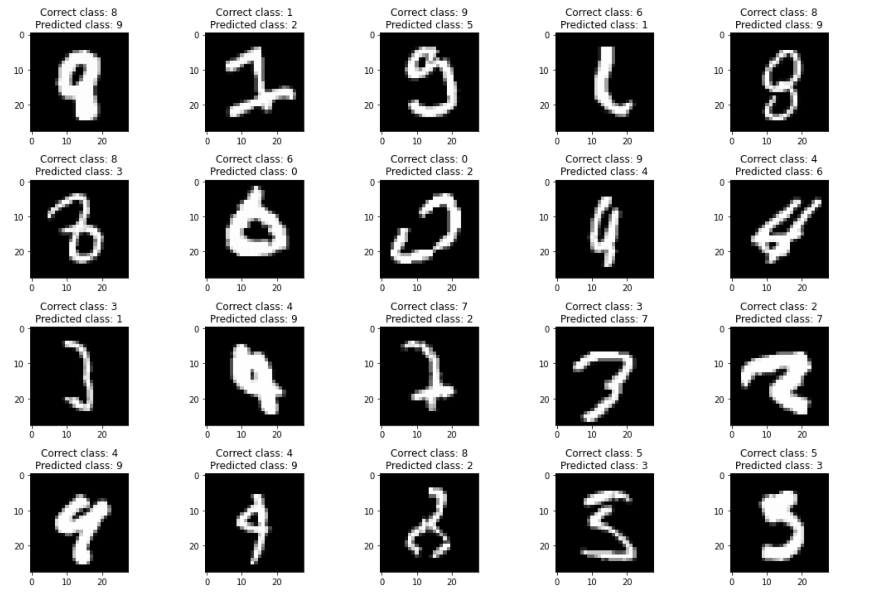
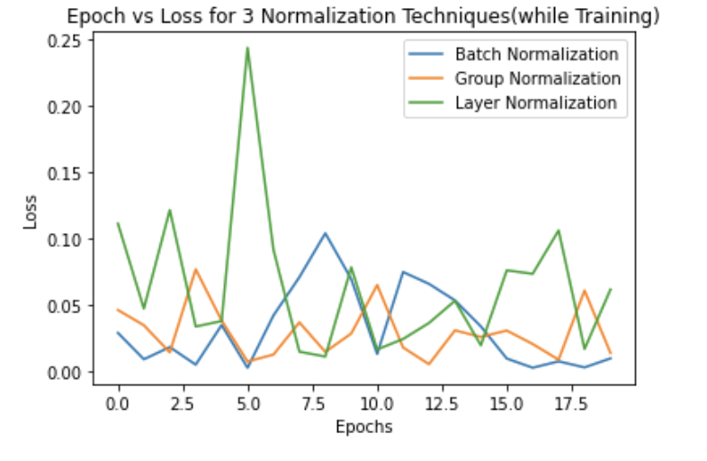
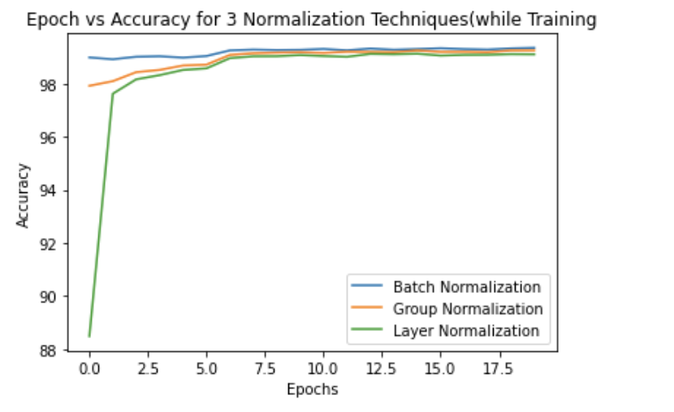
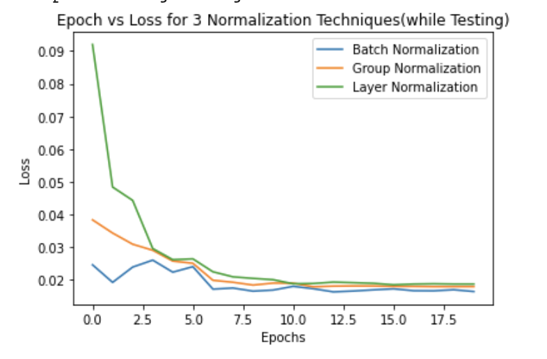
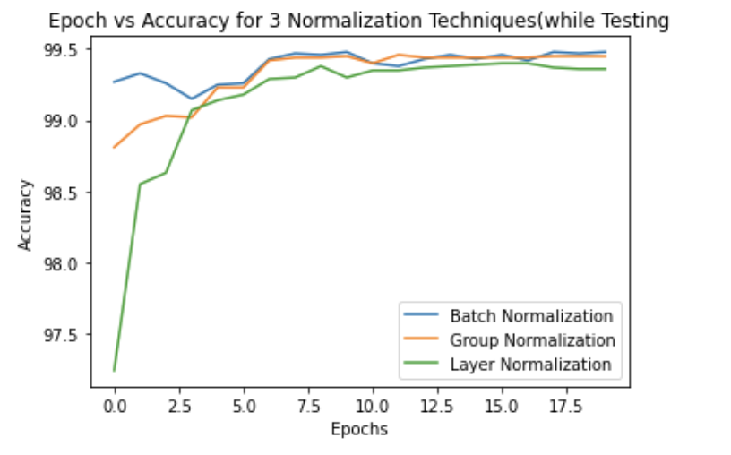

# Session 5 Assignment 
## Objective 
You are making 3 versions of your 4th assignment's best model (or pick one from best assignments):
1. Network with Group Normalisation
2. Network with Layer Normalisation
3. Network with batch normalisation and L1 regularisation
## You Must:
1. Write a single model.py file that includes GN/LN/BN and takes an argument to decide which normalization to include
2. Write a single notebook file to run all the 3 models above for 20 epochs each Create these graphs: Graph 1: Test/Validation Loss for all 3 models together Graph 2: Test/Validation Accuracy for 3 models together graphs must have proper annotation
3. Find 10 misclassified images for each of the 3 models, and show them as a 5x2 image matrix in 3 separately annotated images.
4. write an explanatory README file that explains: what is your code all about, how to perform the 3 normalizations techniques that we covered(cannot use values from the excel sheet shared) your findings for normalization techniques, add all your graphs your 3 collection-of-misclassified-images

### Solution
Created model.py which contains 3 different models(classes) for the above 3 purposes and a function which is which with "LN", "GN", or "BN" according to the needs.
For using L1 normalisation, created a new input for the "train" function whihc is by default "false" and can be turned to "true" if we want to implement L1 normalisation.
For implementing L1:
>if L1_regularisation.lower() == "true": 
>   l1 = 0 
>     for p in model.parameters(): 
>        l1 = l1 + p.abs().sum() 
>      lambda_l1 = loss / (l1 * 10)         # keeping lambda for 10 % loss in weights 
>      loss = loss + lambda_l1 * l1 

### How are all three Normalisation performed:
A batch of images is input to a layer, and each image in that batch is divided in some channels so there are 2 parameters number of images in a batch and number of channels
in a each image. When doing Batch Normalisation for each channel, mean and standard deviation is calculated for all the images in the batch and so no of parameters
 that are used are dependant on the number of channels in the input image. In Layer Normalisation we dont use channels but use each image on its own and mean 
 and standard deviation is calculated for each image(comprising of all channels) in the batch separately and therefor number of parameters used are numbers of images in a batch or batch size.
 Once mean and std dev are calculated each pixels of every image is re evaluated using the corresponding value of mean and std dev. Lastly For Group Normalisation
 each batch is divided in different image and each image(comprising of many channels) is divided in different group(a new parameter: Group size(number of channels per group))
 and for each group mean and std dev are calculated separately and utilised.
 
 #### Results for only Batch Normalisation
 All logs in the python notebbook file
 Results:
 1. Best Train accuracy:99.21%
 2. Best Test Accuracy:99.50%
 
 
 #### Results for only Group Normalisation
Results:
1. Best Train accuracy:99.34%
2. Best Test Accuracy:99.48%

Mismatched Pictures: 
 #### Results for only Layer Normalisation
Results:
1. Best Train accuracy:99.25%
2. Best Test Accuracy:99.46%  

Mismatched Pictures: 
   
 #### Results for Batch Normalisation + L1 regularisation(10%)
Results:
1. Best Train accuracy:99.11%
2. Best Test Accuracy:99.42%

Mismatched Pictures: 

## Comparison of Accuracies and Losses 

