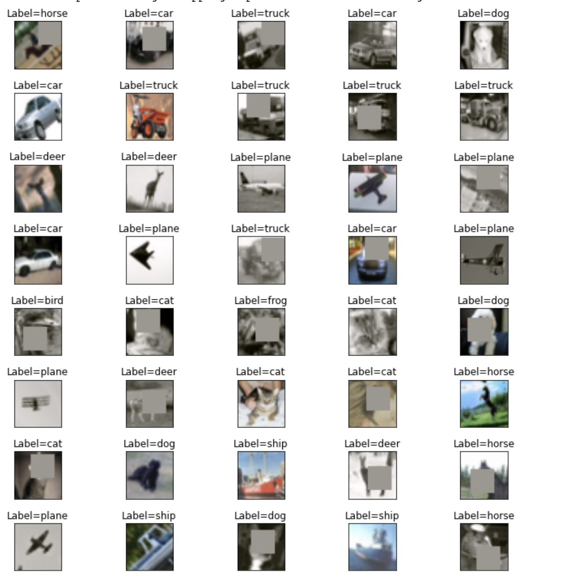

# TSAI - EVA8 Session 6 Assignment

## Problem Statement

1. Run this [network](https://colab.research.google.com/drive/1qlewMtxcAJT6fIJdmMh8pSf2e-dh51Rw)  
2. Fix the network above:  
    1. change the code such that it uses GPU and  
    2. change the architecture to C1C2C3C40 (No MaxPooling, but 3 3x3 layers with stride of 2 instead) (If you can figure out how to use Dilated kernels here instead of MP or strided convolution, then 200pts extra!)   
    3. total RF must be more than 44  
    4. one of the layers must use Depthwise Separable Convolution  
    5. one of the layers must use Dilated Convolution
    use GAP (compulsory)  
    6. add FC after GAP to target #of classes (optional)   
    7. use albumentation library and apply:  
        1. horizontal flip
        2. shiftScaleRotate
        3. coarseDropout (max_holes = 1, max_height=16px, max_width=1, min_holes = 1, min_height=16px, min_width=16px, fill_value=(mean of your dataset), mask_fill_value = None)  
    8. achieve 85% accuracy, as many epochs as you want. Total Params to be less than 200k.  
    9. upload to Github
    10. Attempt S6-Assignment Solution.  
    11. Questions in the Assignment QnA are:  
        1. copy paste your model code from your model.py file (full code)  
        2. copy paste output of torchsummary 
        3. copy-paste the code where you implemented albumentation transformation for all three transformations  
        4. copy paste your training log (you must be running validation/text after each Epoch  
        5. Share the link for your README.md file. 

## Model Architecture

1. The model for this project is based on the C1C2C3C40 architecture with several modifications.
2. Instead of max pooling, the network consists of 3 convolutional layers with 3x3 filters and a stride of 2. 3. GAP is used in the final layer.
4. One layer uses depthwise separable convolutionand one layer uses dilated convolution.

## Data augmentation 
Used HorizontalFlip, Dropout, ShiftScaleRotate.

Sample images,  

## File Structure
1. Model File : Contains the code for the network and function to get_model and the model summary
2. Utils File : utils file contains important functions such as information like mean, std dev for a dataset, plotting misclassified pictures etc.
3. Dataloader : Contains the code for augmenting the images of the dataset using the albumentation library and a function for visualising those augmented images.
4. Training code : Contains a training class which stores the accuracy and loss for making a graph later and functions for training of the network and plotting those graphs
5. Testing Code : Similar to the training class used for testing of the trained model.

## Results

Trainling accuracy: 74.16 %
Test accuracy: 82.44 %

## Misclassified Images

