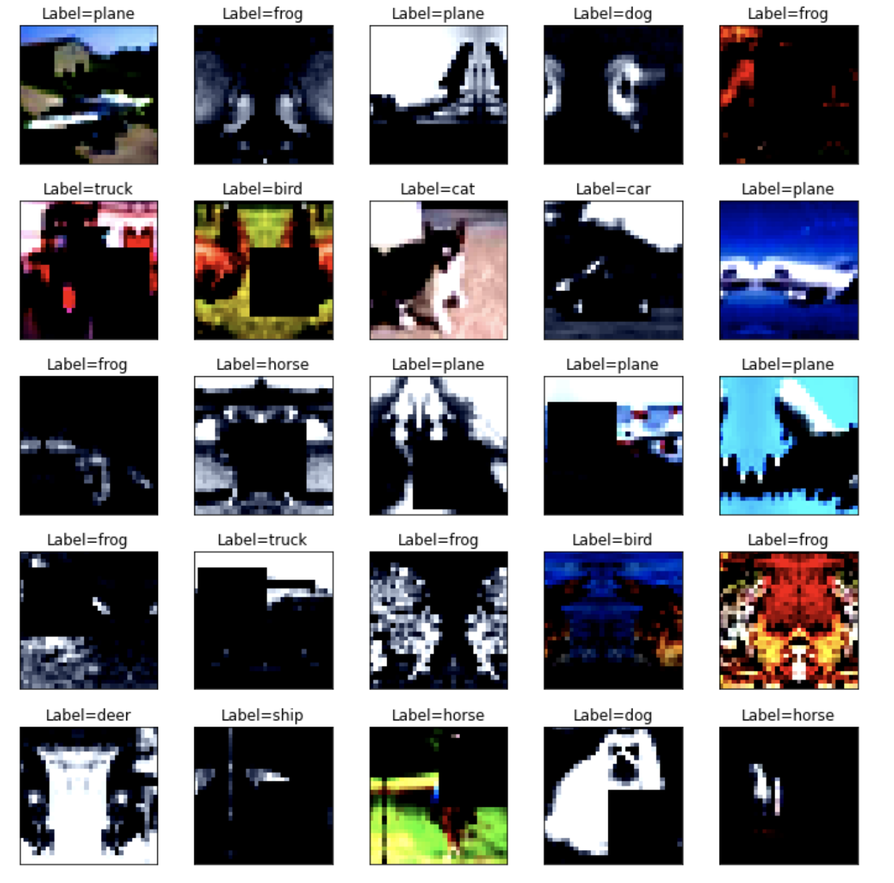
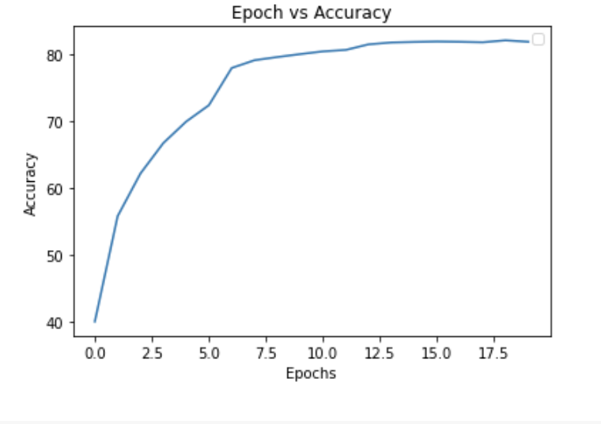
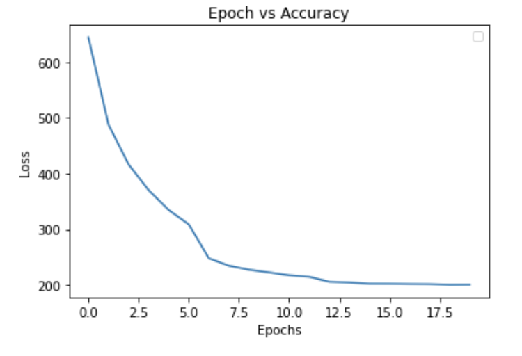
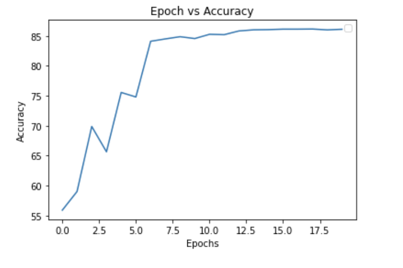
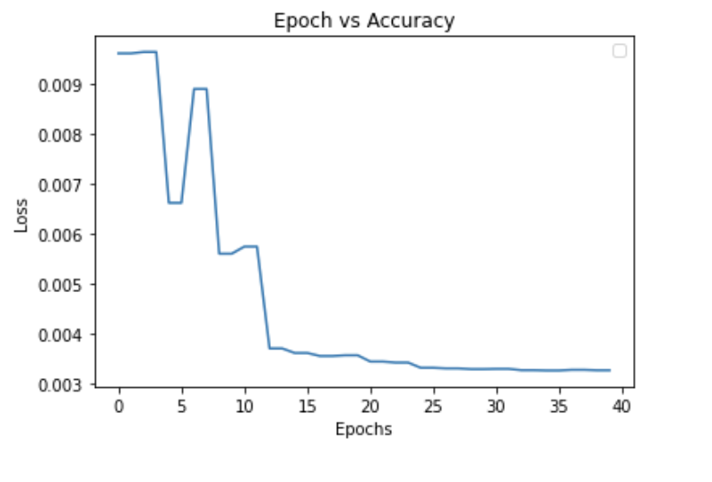
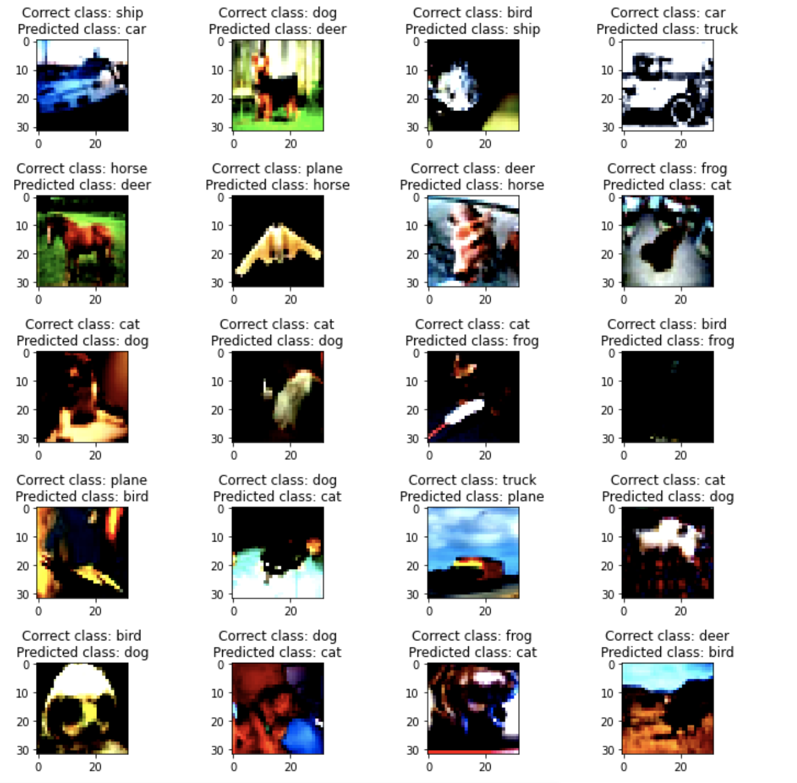
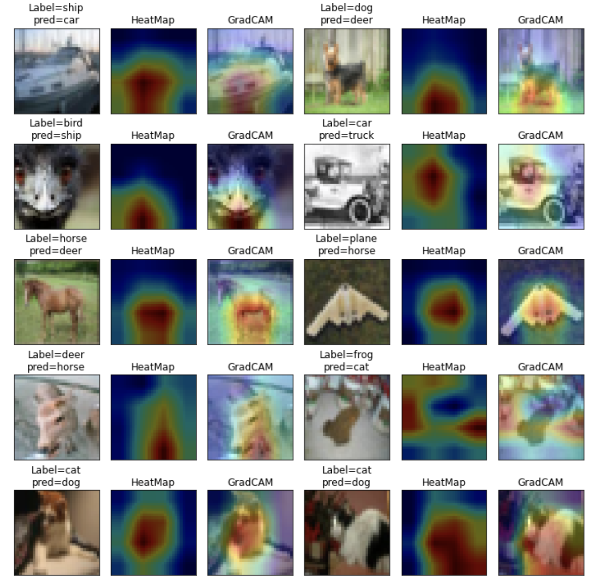

# EVA8 Session 7 Assignment - Solution

## Problem Statement

1. Check this Repo out: https://github.com/kuangliu/pytorch-cifar.  
2. You are going to follow the same structure for your Code from now on. So Create:  
    1. models folder - this is where you'll add all of your future models. Copy resnet.py into this folder, this file should only have ResNet 18/34 models. Delete Bottleneck Class  
    2. main.py - from Google Colab, now onwards, this is the file that you'll import (along with the model). Your main file shall be able to take these params or you should be able to pull functions from it and then perform operations, like (including but not limited to):  
        1. training and test loops  
        2. data split between test and train  
        3. epochs  
        4. batch size  
        5. which optimizer to run  
        6. do we run a scheduler?  
    3. utils.py file (or a folder later on when it expands) - this is where you will add all of your utilities like:
            image transforms,
            gradcam,
            misclassification code,
            tensorboard related stuff
            advanced training policies, etc
            etc 
    4. Name this main repos something, and don't call it Assignment 7. This is what you'll import for all the rest of the assignments. Add a proper readme describing all the files.  
3. Your assignment is to build the above training structure. Train ResNet18 on Cifar10 for 20 Epochs. The assignment must:
    1. pull your Github code to google colab (don't copy-paste code)  
    2. prove that you are following the above structure  
    3. that the code in your google collab notebook is NOTHING.. barely anything. There should not be any function or class that you can define in your Google Colab Notebook. Everything must be imported from all of your other files
    4. your colab file must:
            train resnet18 for 20 epochs on the CIFAR10 dataset
            show loss curves for test and train datasets
            show a gallery of 10 misclassified images
            show gradcam 

        Links to an external site. output on 10 misclassified images. Remember if you are applying GradCAM on a channel that is less than 5px, then please don't bother to submit the assignment. 😡🤬🤬🤬🤬
    5. Once done, upload the code to GitHub, and share the code. This readme must link to the main repo so we can read your file structure.  
    6. Train for 20 epochs  
    7. Get 10 misclassified images  
    8. Get 10 GradCam outputs on any misclassified images (remember that you MUST use the library we discussed in the class)  
    9. Apply these transforms while training:  
        1. RandomCrop(32, padding=4)
        2. CutOut(16x16)  

4. Assignment Submission Questions:  

    1. Share the COMPLETE code of your model.py  
    2. Share the COMPLETE code of your utils.py  
    3. Share the COMPLETE code of your main.py  
    4. Copy-paste the training log (cannot be ugly)  
    5. Copy-paste the 10/20 Misclassified Images Gallery  
    6. Copy-paste the 10/20 GradCam outputs Gallery  
    7. Share the link to your MAIN repo  
    8. Share the link to your README of Assignment 7 (cannot be in the MAIN Repo, but Assignment 8 repo) 
    
## Solution

We implement Resnet18 on cifar dataset using different albumentation tranforms and keeping every part of the data separately in different codes. I first 
cloned the `EVA8-pytorch` folder inside the python notebook and then import all the methods from the main, model and utils folder and used them. I loaded the CIFAR10 image dataset in a dataset and them them passed them to the dataloader via the albumentation transforms library. Then passed the train dataset over the resnet model and plot the misclassified images as well as the grad cam on these images.

## File Structure

[Main repo - Which contains all the models and the helper files](https://github.com/shreyash-99/EVA8/tree/main/EVA8-pytorch)

Information about the Main repo is in its README file.

## Training and Results:

#### Auggmented images

#### Training Curves:

#### Testing Curves:

#### Misclassified images:

#### GradCam output on 10 misclassified images:

#### Accuracies:
Highest training accuracy: 82.16%
Highest testing accuracy: 86.14%

##### Accuracy class wise:
1. Accuracy of plane : 82 %
2. Accuracy of   car : 100 %
3. Accuracy of  bird : 75 %
4. Accuracy of   cat : 67 %
5. Accuracy of  deer : 81 %
6. Accuracy of   dog : 81 %
7. Accuracy of  frog : 91 %
8. Accuracy of horse : 92 %
9. Accuracy of  ship : 90 %
10. Accuracy of truck : 92 %

#### Training Logs:

Loss=1.2367753982543945 Batch_id=390 Accuracy=40.05: 100%|██████████| 391/391 [00:50<00:00,  7.76it/s]
Test set: Average loss: 0.0096, Accuracy: 5588/10000 (55.88%)

Loss=1.2701382637023926 Batch_id=390 Accuracy=55.84: 100%|██████████| 391/391 [00:48<00:00,  8.11it/s]
Test set: Average loss: 0.0096, Accuracy: 5900/10000 (59.00%)

Loss=1.1523507833480835 Batch_id=390 Accuracy=62.23: 100%|██████████| 391/391 [00:48<00:00,  8.09it/s]
Test set: Average loss: 0.0066, Accuracy: 6987/10000 (69.87%)

Loss=0.8869228363037109 Batch_id=390 Accuracy=66.77: 100%|██████████| 391/391 [00:48<00:00,  8.10it/s]
Test set: Average loss: 0.0089, Accuracy: 6564/10000 (65.64%)

Loss=0.9432547688484192 Batch_id=390 Accuracy=69.99: 100%|██████████| 391/391 [00:48<00:00,  8.09it/s]
Test set: Average loss: 0.0056, Accuracy: 7556/10000 (75.56%)

Loss=0.7091596722602844 Batch_id=390 Accuracy=72.45: 100%|██████████| 391/391 [00:48<00:00,  8.10it/s]
Test set: Average loss: 0.0057, Accuracy: 7480/10000 (74.80%)

Loss=0.6313072443008423 Batch_id=390 Accuracy=78.02: 100%|██████████| 391/391 [00:48<00:00,  8.10it/s]
Test set: Average loss: 0.0037, Accuracy: 8411/10000 (84.11%)

Loss=0.37528136372566223 Batch_id=390 Accuracy=79.18: 100%|██████████| 391/391 [00:48<00:00,  8.09it/s]
Test set: Average loss: 0.0036, Accuracy: 8451/10000 (84.51%)

Loss=0.7871106863021851 Batch_id=390 Accuracy=79.66: 100%|██████████| 391/391 [00:48<00:00,  8.06it/s]
Test set: Average loss: 0.0036, Accuracy: 8488/10000 (84.88%)

Loss=0.6526386737823486 Batch_id=390 Accuracy=80.10: 100%|██████████| 391/391 [00:48<00:00,  8.08it/s]
Test set: Average loss: 0.0036, Accuracy: 8457/10000 (84.57%)

Loss=0.6152591705322266 Batch_id=390 Accuracy=80.50: 100%|██████████| 391/391 [00:48<00:00,  8.06it/s]
Test set: Average loss: 0.0034, Accuracy: 8528/10000 (85.28%)

Loss=0.5228683948516846 Batch_id=390 Accuracy=80.73: 100%|██████████| 391/391 [00:48<00:00,  8.07it/s]
Test set: Average loss: 0.0034, Accuracy: 8522/10000 (85.22%)

Loss=0.49664026498794556 Batch_id=390 Accuracy=81.56: 100%|██████████| 391/391 [00:48<00:00,  8.03it/s]
Test set: Average loss: 0.0033, Accuracy: 8584/10000 (85.84%)

Loss=0.49911370873451233 Batch_id=390 Accuracy=81.84: 100%|██████████| 391/391 [00:48<00:00,  8.07it/s]
Test set: Average loss: 0.0033, Accuracy: 8603/10000 (86.03%)

Loss=0.4738570749759674 Batch_id=390 Accuracy=81.92: 100%|██████████| 391/391 [00:49<00:00,  7.92it/s]
Test set: Average loss: 0.0033, Accuracy: 8606/10000 (86.06%)

Loss=0.43995141983032227 Batch_id=390 Accuracy=81.98: 100%|██████████| 391/391 [00:49<00:00,  7.83it/s]
Test set: Average loss: 0.0033, Accuracy: 8614/10000 (86.14%)

Loss=0.4017840325832367 Batch_id=390 Accuracy=81.94: 100%|██████████| 391/391 [00:49<00:00,  7.85it/s]
Test set: Average loss: 0.0033, Accuracy: 8614/10000 (86.14%)

Loss=0.4330795407295227 Batch_id=390 Accuracy=81.87: 100%|██████████| 391/391 [00:49<00:00,  7.88it/s]
Test set: Average loss: 0.0033, Accuracy: 8616/10000 (86.16%)

Loss=0.4703265130519867 Batch_id=390 Accuracy=82.16: 100%|██████████| 391/391 [00:49<00:00,  7.86it/s]
Test set: Average loss: 0.0033, Accuracy: 8602/10000 (86.02%)

Loss=0.5491556525230408 Batch_id=390 Accuracy=81.94: 100%|██████████| 391/391 [00:49<00:00,  7.86it/s]
Test set: Average loss: 0.0033, Accuracy: 8612/10000 (86.12%)

Finished Training

