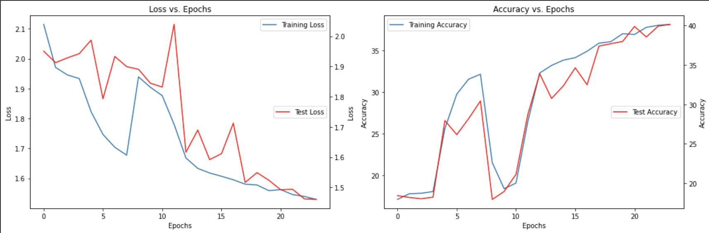
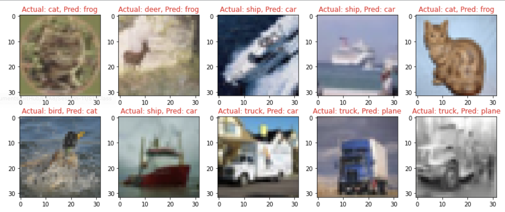

# TSAI - EVA8 Session 9 Assignment

## Problem Statement
Build the following network:

1. That takes a CIFAR10 image (32x32x3)  
2. Add 3 Convolutions to arrive at AxAx48 dimensions (e.g. 32x32x3 | 3x3x3x16 >> 3x3x16x32 >> 3x3x32x48)   
3. Apply GAP and get 1x1x48, call this X  
4. Create a block called ULTIMUS that:  
    1. Creates 3 FC layers called K, Q and V such that:  
        1. X*K = 48*48x8 > 8  
        2. X*Q = 48*48x8 > 8  
        3. X*V = 48*48x8 > 8  
    2. then create AM = SoftMax(QTK)/(8^0.5) = 8*8 = 8  
    3. then Z = V*AM = 8*8 > 8  
    4. then another FC layer called Out that:  
        1. Z*Out = 8*8x48 > 48  
5. Repeat this Ultimus block 4 times  
6. Then add final FC layer that converts 48 to 10 and sends it to the loss function.  
7. Model would look like this C>C>C>U>U>U>U>FFC>Loss  
8. Train the model for 24 epochs using the OCP that I wrote in class. Use ADAM as an optimizer.  
9. Submit the link and answer the questions on the assignment page:  
    1. Share the link to the main repo (must have Assignment 7/8/9 model7/8/9.py files (or similarly named))  
    2. Share the code of model9.py  
    3. Copy and paste the Training Log  
    4. Copy and paste the training and validation loss chart  

## Solution  

### Notebook & Model  
Training Notebook : [link](./Session-9_Assignment.ipynb) and Model [link](https://github.com/shreyash-99/EVA8/blob/main/Session_9_Assignment/model9.py)
Training accuracy: 38.12% and Test Accuracy: 40.14%

### Training/Test Loss and Accuracy  

### Misclassified Images

## Logs

Touched 40% Accuracy in 24th epoch 

EPOCH: 1 (LR: 0.0005)
Batch_id=97 Loss=2.11505 Accuracy=17.09%: 100%|██████████| 98/98 [00:22<00:00,  4.38it/s]
Test set: Average loss: 1.9508, Accuracy: 1844/10000 (18.44%)

EPOCH: 2 (LR: 0.0014394972305070302)
Batch_id=97 Loss=1.97109 Accuracy=17.78%: 100%|██████████| 98/98 [00:24<00:00,  4.05it/s]
Test set: Average loss: 1.9128, Accuracy: 1821/10000 (18.21%)

EPOCH: 3 (LR: 0.002378994461014061)
Batch_id=97 Loss=1.94601 Accuracy=17.83%: 100%|██████████| 98/98 [00:22<00:00,  4.38it/s]
Test set: Average loss: 1.9287, Accuracy: 1804/10000 (18.04%)

EPOCH: 4 (LR: 0.0033184916915210906)
Batch_id=97 Loss=1.93370 Accuracy=18.04%: 100%|██████████| 98/98 [00:22<00:00,  4.41it/s]
Test set: Average loss: 1.9425, Accuracy: 1825/10000 (18.25%)

EPOCH: 5 (LR: 0.004257988922028121)
Batch_id=97 Loss=1.82280 Accuracy=25.60%: 100%|██████████| 98/98 [00:22<00:00,  4.45it/s]
Test set: Average loss: 1.9874, Accuracy: 2796/10000 (27.96%)

EPOCH: 6 (LR: 0.0049453140943877556)
Batch_id=97 Loss=1.74704 Accuracy=29.74%: 100%|██████████| 98/98 [00:22<00:00,  4.44it/s]
Test set: Average loss: 1.7933, Accuracy: 2617/10000 (26.17%)

EPOCH: 7 (LR: 0.004685157844387756)
Batch_id=97 Loss=1.70399 Accuracy=31.54%: 100%|██████████| 98/98 [00:20<00:00,  4.75it/s]
Test set: Average loss: 1.9334, Accuracy: 2819/10000 (28.19%)

EPOCH: 8 (LR: 0.004425001594387756)
Batch_id=97 Loss=1.67756 Accuracy=32.14%: 100%|██████████| 98/98 [00:20<00:00,  4.72it/s]
Test set: Average loss: 1.8996, Accuracy: 3044/10000 (30.44%)

EPOCH: 9 (LR: 0.004164845344387755)
Batch_id=97 Loss=1.93957 Accuracy=21.51%: 100%|██████████| 98/98 [00:21<00:00,  4.59it/s]
Test set: Average loss: 1.8908, Accuracy: 1796/10000 (17.96%)

EPOCH: 10 (LR: 0.0039046890943877552)
Batch_id=97 Loss=1.90476 Accuracy=18.38%: 100%|██████████| 98/98 [00:23<00:00,  4.19it/s]
Test set: Average loss: 1.8449, Accuracy: 1897/10000 (18.97%)

EPOCH: 11 (LR: 0.0036445328443877553)
Batch_id=97 Loss=1.87675 Accuracy=19.06%: 100%|██████████| 98/98 [00:21<00:00,  4.56it/s]
Test set: Average loss: 1.8320, Accuracy: 2114/10000 (21.14%)

EPOCH: 12 (LR: 0.0033843765943877553)
Batch_id=97 Loss=1.78117 Accuracy=26.44%: 100%|██████████| 98/98 [00:22<00:00,  4.40it/s]
Test set: Average loss: 2.0395, Accuracy: 2873/10000 (28.73%)

EPOCH: 13 (LR: 0.003124220344387755)
Batch_id=97 Loss=1.66833 Accuracy=32.28%: 100%|██████████| 98/98 [00:22<00:00,  4.43it/s]
Test set: Average loss: 1.6161, Accuracy: 3389/10000 (33.89%)

EPOCH: 14 (LR: 0.0028640640943877554)
Batch_id=97 Loss=1.63339 Accuracy=33.19%: 100%|██████████| 98/98 [00:21<00:00,  4.47it/s]
Test set: Average loss: 1.6896, Accuracy: 3075/10000 (30.75%)

EPOCH: 15 (LR: 0.0026039078443877554)
Batch_id=97 Loss=1.61798 Accuracy=33.83%: 100%|██████████| 98/98 [00:22<00:00,  4.42it/s]
Test set: Average loss: 1.5918, Accuracy: 3236/10000 (32.36%)

EPOCH: 16 (LR: 0.002343751594387755)
Batch_id=97 Loss=1.60704 Accuracy=34.13%: 100%|██████████| 98/98 [00:20<00:00,  4.80it/s]
Test set: Average loss: 1.6113, Accuracy: 3464/10000 (34.64%)

EPOCH: 17 (LR: 0.002083595344387755)
Batch_id=97 Loss=1.59527 Accuracy=34.89%: 100%|██████████| 98/98 [00:21<00:00,  4.47it/s]
Test set: Average loss: 1.7124, Accuracy: 3249/10000 (32.49%)

EPOCH: 18 (LR: 0.001823439094387755)
Batch_id=97 Loss=1.58060 Accuracy=35.86%: 100%|██████████| 98/98 [00:22<00:00,  4.44it/s]
Test set: Average loss: 1.5162, Accuracy: 3739/10000 (37.39%)

EPOCH: 19 (LR: 0.001563282844387755)
Batch_id=97 Loss=1.57786 Accuracy=36.04%: 100%|██████████| 98/98 [00:22<00:00,  4.36it/s]
Test set: Average loss: 1.5487, Accuracy: 3769/10000 (37.69%)

EPOCH: 20 (LR: 0.0013031265943877547)
Batch_id=97 Loss=1.55895 Accuracy=37.00%: 100%|██████████| 98/98 [00:22<00:00,  4.41it/s]
Test set: Average loss: 1.5234, Accuracy: 3798/10000 (37.98%)

EPOCH: 21 (LR: 0.0010429703443877551)
Batch_id=97 Loss=1.56239 Accuracy=36.91%: 100%|██████████| 98/98 [00:21<00:00,  4.47it/s]
Test set: Average loss: 1.4921, Accuracy: 3988/10000 (39.88%)

EPOCH: 22 (LR: 0.0007828140943877552)
Batch_id=97 Loss=1.54571 Accuracy=37.77%: 100%|██████████| 98/98 [00:22<00:00,  4.35it/s]
Test set: Average loss: 1.4935, Accuracy: 3854/10000 (38.54%)

EPOCH: 23 (LR: 0.0005226578443877552)
Batch_id=97 Loss=1.53954 Accuracy=38.01%: 100%|██████████| 98/98 [00:21<00:00,  4.49it/s]
Test set: Average loss: 1.4618, Accuracy: 3992/10000 (39.92%)

EPOCH: 24 (LR: 0.0002625015943877552)
Batch_id=97 Loss=1.52954 Accuracy=38.12%: 100%|██████████| 98/98 [00:23<00:00,  4.26it/s]
Test set: Average loss: 1.4599, Accuracy: 4014/10000 (40.14%)

## Key Takeaways
- Acquired knowledge on the fundamental components of the transformer architecture, with a primary emphasis on the attention mechanism.
- The model's accuracy was limited due to insufficient model capacity and the absence of positional encoding.